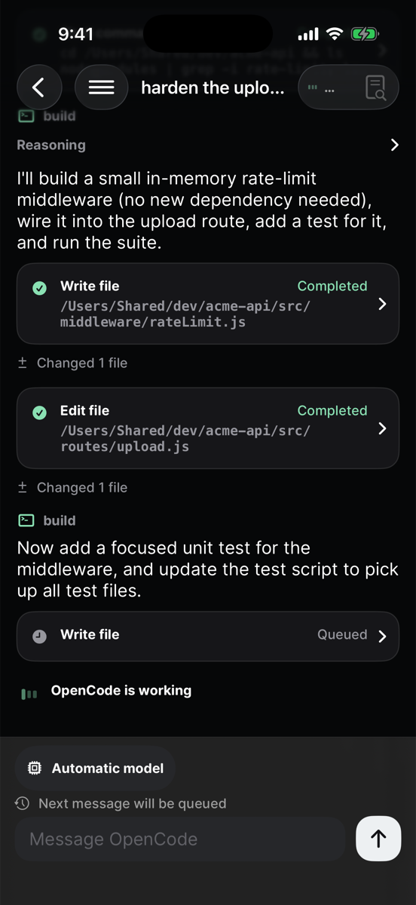
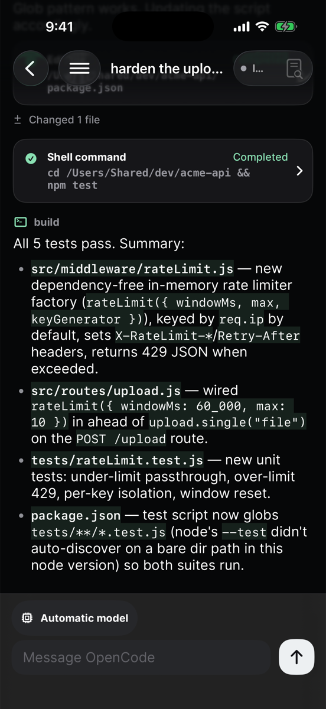
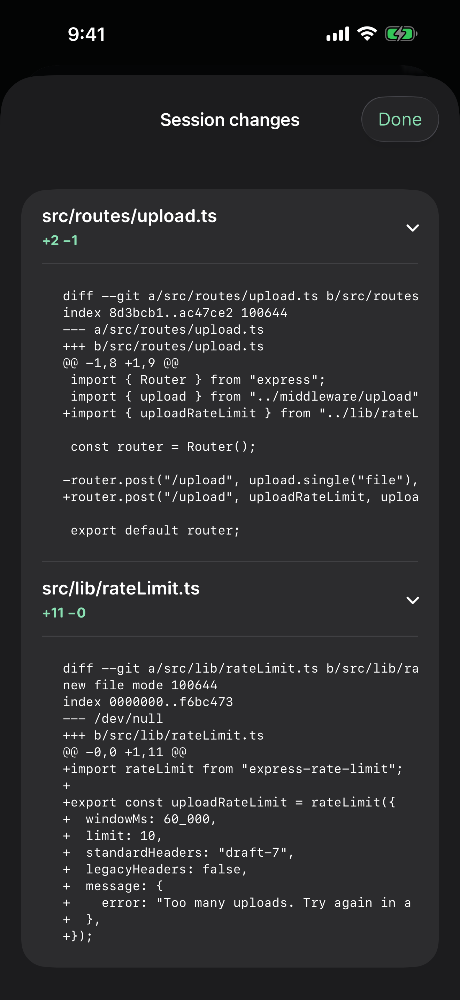
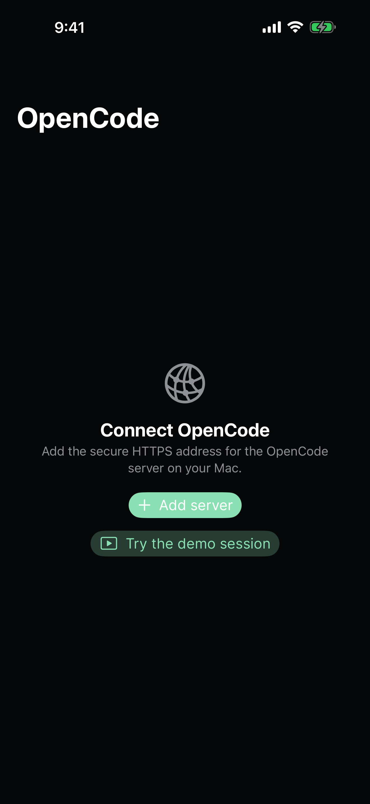

# BYOT

BYOT is a native iOS client for [OpenCode](https://opencode.ai), the open-source coding agent. It connects to the OpenCode server running on your own computer and lets you drive real coding sessions from your iPhone.

[**Download on the App Store**](https://apps.apple.com/us/app/byot/id6782403920) · [byot.app](https://byot.app)

<p align="center">
  
  
  
  
</p>

## What it does

- Browse the projects and sessions on your server
- Send prompts and watch the full turn stream live — assistant text, reasoning, files, patches
- See every tool call with its input, progress, output, and errors
- Review session diffs before you trust the result
- Answer permission requests: allow once, always allow, or reject
- Answer questions with choices or your own text
- Queue follow-up prompts while a turn runs, or steer the current one
- Pick the model per prompt from your server's own catalog

## Requirements

- An OpenCode server (1.18+) on a machine you control — `opencode serve`
- Reachable from your phone over **HTTPS** with Basic auth. [Tailscale](https://tailscale.com) (`tailscale serve`) is the usual path; any valid TLS endpoint works. The app refuses plain HTTP.

See the [Mac mini connection runbook](docs/milestone-ios-opencode-connection.md)
for v1, v2 beta service pairing, and Tailscale setup.

## Development

Requires Xcode 16+ and [XcodeGen](https://github.com/yonaskolb/XcodeGen).

```bash
xcodegen
open BYOT.xcodeproj
```

Run the tests with the BYOT scheme, or:

```bash
xcodebuild test -project BYOT.xcodeproj -scheme BYOT -destination 'platform=iOS Simulator,name=iPhone 16'
```

## Status

Early, and the surface is intentionally small. Expect rough edges — [issues](https://github.com/steventsao/byot/issues) welcome.

## License

[MIT](./LICENSE). Bundled [Open Runde](https://github.com/lauridskern/open-runde) fonts keep their own license — see [Sources/Resources/THIRD-PARTY-NOTICES.txt](./Sources/Resources/THIRD-PARTY-NOTICES.txt).
