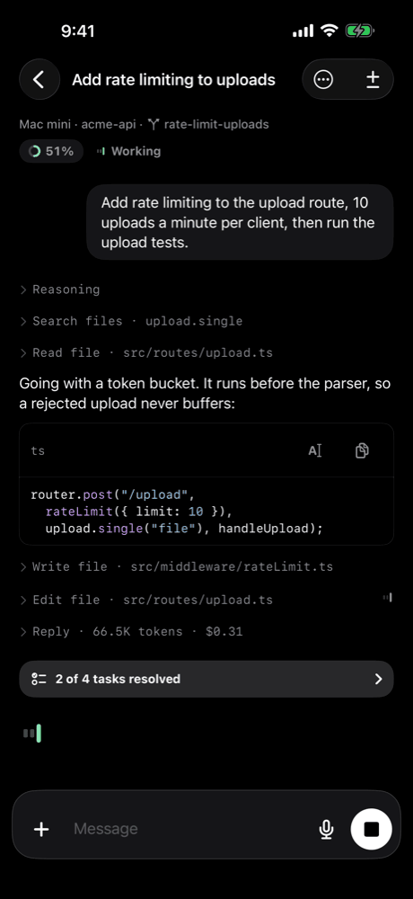
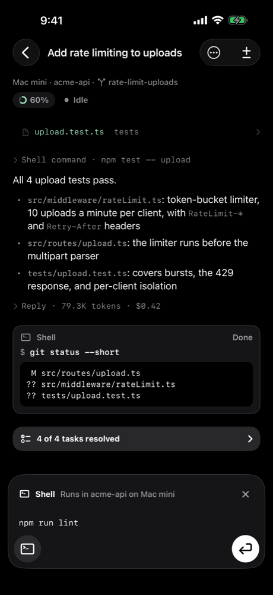
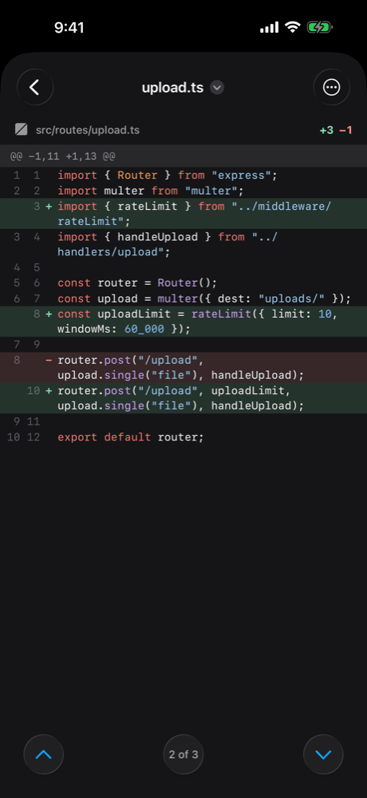
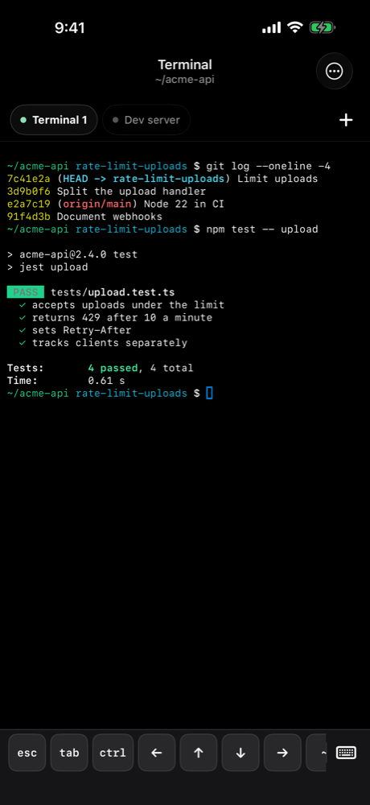

# BYOT

BYOT is a native iOS client for [OpenCode](https://opencode.ai), the open-source coding agent. It connects to the OpenCode server running on your own computer and lets you drive real coding sessions from your iPhone or iPad.

[**Download on the App Store**](https://apps.apple.com/us/app/byot/id6782403920) · [byot.app](https://byot.app)

<p align="center">
  
  
  
  
</p>

## What it does

- Browse projects and sessions across your servers, with live Working, Idle, and Needs input status
- Watch each turn stream live: text, reasoning, syntax-highlighted code, and every tool call with its input, output, and errors
- Review session diffs in color before you trust the result
- Answer permission requests (allow once, always allow, reject) and questions
- Run a shell command in the session's project by starting a prompt with `!`
- Open terminal tabs on the server where it offers them
- Check how full the model's context is, and what the session has cost
- Queue follow-ups while a turn runs, pick the model per prompt, and keep unsent drafts across relaunches
- Get optional push alerts for approvals, questions, finished turns, and errors ([setup](push/README.md))

## Requirements

- An OpenCode server (1.18+) on a machine you control — `opencode serve`
- Reachable from your phone over **HTTPS** with Basic auth. [Tailscale](https://tailscale.com) (`tailscale serve`) is the usual path; any valid TLS endpoint works. Plain HTTP is used only for a local network IP address found nearby (`opencode serve --mdns`) or added with a pairing code.
- Add it by scanning a pairing code from [`scripts/byot-pair-qr.sh`](scripts/byot-pair-qr.sh), finding it nearby, or typing the address ([details](docs/features/server-pairing.md)).

## Development

For the public landing page, see [web/README.md](./web/README.md).

Requires Xcode 16+ and [XcodeGen](https://github.com/yonaskolb/XcodeGen).

```bash
xcodegen
open BYOT.xcodeproj
```

Run the tests with the BYOT scheme, or:

```bash
xcodebuild test -project BYOT.xcodeproj -scheme BYOT -destination 'platform=iOS Simulator,name=iPhone 16'
```

The [OpenCode service layers](docs/opencode-service-layers.md) explain adapter
composition, dependency injection, discovery lifetime, and test seams.

## Status

Early, and the surface is intentionally small. Expect rough edges — [issues](https://github.com/steventsao/byot/issues) welcome.

## License

[MIT](./LICENSE). Bundled [Open Runde](https://github.com/lauridskern/open-runde) fonts keep their own license — see [Sources/Resources/THIRD-PARTY-NOTICES.txt](./Sources/Resources/THIRD-PARTY-NOTICES.txt).
