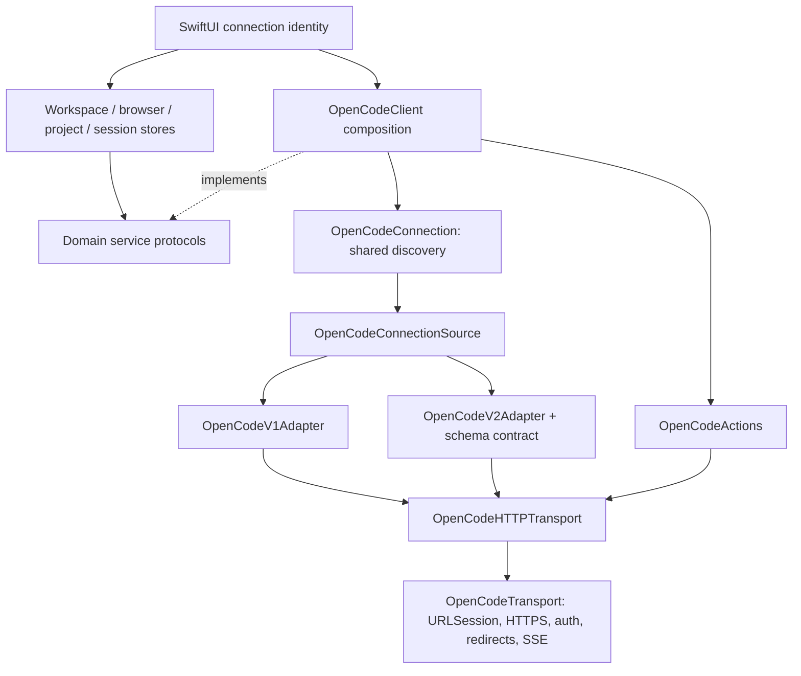

# OpenCode service layers

BYOT uses Swift protocols for service contracts and explicit construction for
their live implementations. `OpenCodeClient` assembles one connection scope from
a server profile and transport. Its value copies share that connection's protocol
discovery and adapter, while separate clients have separate scopes.

This follows the service/Layer separation in the vendored Effect source at
[`0d083ba`](https://github.com/Effect-TS/effect/tree/0d083ba):

| Effect pattern | BYOT equivalent |
| --- | --- |
| Service contracts in `Context` | `OpenCodeWorkspaceServicing`, `OpenCodeSessionBrowsing`, `OpenCodeProjectServicing`, `OpenCodeSessionServicing`, `OpenCodeHTTPTransport` |
| Layers declare and construct their dependencies | `OpenCodeClient` composes transport, actions, and connection; `OpenCodeLiveConnectionSource` constructs the selected adapter |
| A shared layer's acquisition is memoized | `OpenCodeConnection` shares in-flight discovery/schema work and caches the resulting adapter |
| Implementation selected from configuration | Health chooses v1/v2; the v2 server's OpenAPI schema chooses its wire contract |
| Test layers replace individual services | Stores accept domain services; connection tests replace `OpenCodeConnectionSource`; wire tests replace HTTP transport or URLSession |
| Scoped resource ownership | The connection owns discovery tasks; each event consumer owns and cancels its stream task |

Reference examples:
[composition](https://github.com/Effect-TS/effect/blob/0d083ba/ai-docs/src/01_effect/03_services/20_layer-composition.ts),
[implementation selection](https://github.com/Effect-TS/effect/blob/0d083ba/ai-docs/src/01_effect/03_services/20_layer-unwrap.ts),
[test layers](https://github.com/Effect-TS/effect/blob/0d083ba/ai-docs/src/09_testing/20_layer-tests.ts),
and [Layer implementation](https://github.com/Effect-TS/effect/blob/0d083ba/packages/effect/src/Layer.ts).
The application remains native Swift with no additional runtime dependency.

## Boundaries

- Adapters receive their transport and profile at construction. Operations accept
  domain arguments, and route/DTO differences stay in the adapter files.
- `OpenCodeActions` owns permission, question, and form wire formats. A request's
  API version remains authoritative: a v1 server may also expose v2 action routes.
  The negotiated adapter reports form support without a concrete type cast.
- HTTP response validation and JSON helpers sit on the transport contract. SSE
  framing, limits, and overflow behavior live in `OpenCodeEventStream`; the
  transport has no dependency on the client facade.
- Stores require only the service contract they consume. The session store takes
  a server UUID separately for model preferences. `OpenCodeStoreComposition`
  supplies the live client convenience initializer at the application boundary.
- Connected views retain their client with their SwiftUI identity. The existing
  root identity changes when connection configuration changes, rebuilding the
  client and stores together.

## Discovery and lifetime

The first operation detects the server protocol, then constructs the appropriate
adapter. Only v2 loads `/openapi.json`. Concurrent consumers share each acquisition,
and failed acquisition can be retried. A supplied protocol hint skips initial
health detection but never skips v2 schema validation.

An explicit health/compatibility re-probe clears the protocol and adapter,
increments a generation, and cancels an older schema task. The generation is
checked again after every adapter acquisition. Even a source that ignores
cancellation cannot publish an old schema into the new generation. A failed
refresh leaves the connection unresolved so the next operation redetects it.
Already dispatched domain requests finish using their acquired adapter.

Discovery belongs to the connection. Cancelling a waiter does not cancel work
shared with another screen; that waiter receives cancellation when acquisition
settles, before dispatching its domain operation. Network timeouts still apply.
Event streams have a separate consumer lifetime: termination cancels their task
and underlying URLSession byte stream. Injected/shared URLSessions remain owned
by their creator and are never invalidated by a client.

## Extending and testing

Add a normalized operation to the relevant service contract, implement wire
behavior in each adapter, and expose it through the facade. Construct additional
dependencies once in the client/source rather than inside each operation. Keep
server-specific DTOs private to their implementation.

`OpenCodeConnectionLayerTests` covers concurrent client copies, stale schema
completion after refresh, cancellation during discovery and schema loading,
retry after failures, and isolation between connection scopes. Existing transport,
hybrid action, beta contract, store, and transcript tests remain regression coverage.

Run `scripts/test-opencode-upstream.sh` for real v1/v2 client and UI acceptance.
It also captures screenshots of server setup, model selection, sending/reloading
transcripts, grouped sessions, changes availability, and switching saved servers.
See [the runner instructions](../scripts/e2e/README.md).
