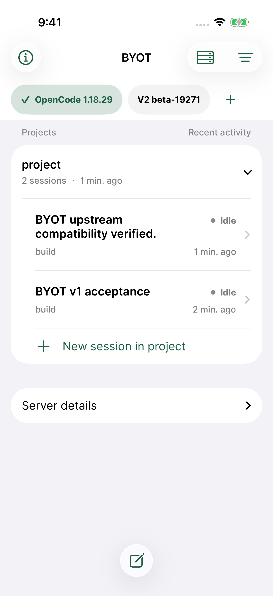
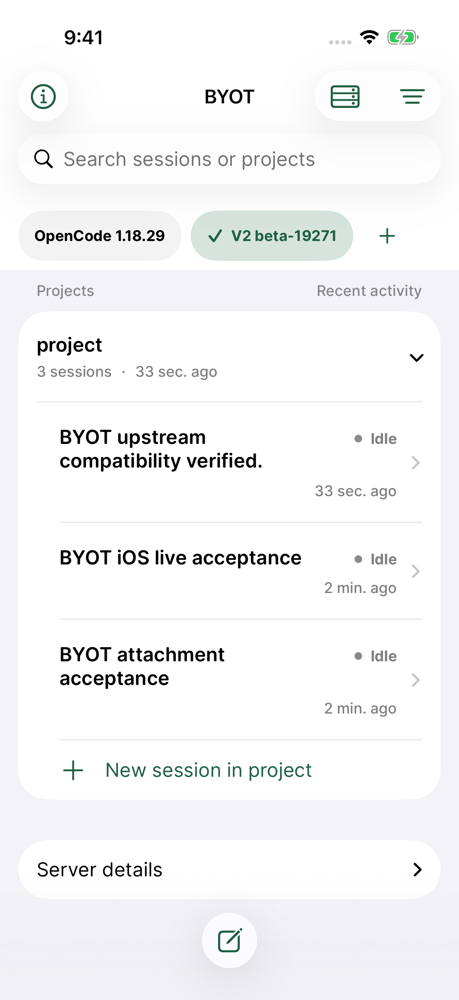
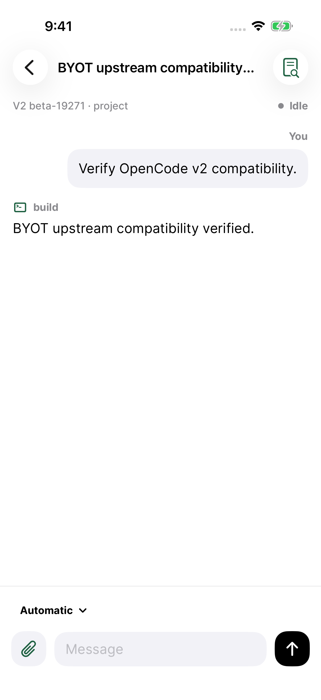

# BYOT 1.0.12 — upstream compatibility

**1.0.12 (20260908154542)** fixes duplicate project-grouped sessions when OpenCode 1 returns both its global non-Git project and the configured working directory. Sessions appear once under their matching directory. Overlapping responses still preserve usable sessions when a directory request fails; real empty projects remain available. The horizontal server bar, direct session navigation, independent sorting, search, and appearance settings from 1.0.11 are retained.

The screenshot review of the first upstream run exposed this edge case despite the initial 166 passing tests. A new regression reproduced it before the fix. The final run adds that regression, a partial-failure check, and a real UI assertion that the v1 session appears exactly once.

## Verified versions and scope

| Upstream executable | Version | Result |
| --- | --- | --- |
| `opencode-ai` | `1.18.29` | Passed |
| `@opencode-ai/cli` | `0.0.0-beta-19271` | Passed |

**168 tests passed, zero failures, zero skips:** 71 XCTest tests, 96 Swift Testing tests, and one UI workflow spanning both servers. Tested on iPhone 17 Pro simulator, iOS 26.5 (23F77), Xcode 26.5 (17F42), with the production signed app, HTTPS transport, authentication, and Keychain. The upstream CLIs are real published executables; model responses come from a deterministic local OpenAI-compatible fixture. This does not establish physical-device or paid-provider compatibility.

Both versions passed automatic detection, project/session discovery, session creation, model discovery, sending and receiving a prompt, and transcript reload. V2 additionally passed streamed event reduction, idempotent retry, an attachment-only prompt, form answer/cancel, permission approval, and the idle interrupt response. The UI exercises adding both servers, direct chat creation, model picker, Changes capability, grouping, switching, and persisted selection/password retrieval after relaunch.

V2 still does not expose per-session diffs or provider connection status. The app explains these capabilities rather than presenting workspace changes as one session's diff.

## Run again

```sh
scripts/test-opencode-upstream.sh
```

The [runner](../../../scripts/e2e/README.md) installs pinned CLIs into an isolated tools directory, starts fresh server data/configuration and a local model, creates a dedicated simulator and test CA, runs the tests, and exports screenshot attachments. Shell provider credentials are not inherited. The temporary simulator and owned server processes are removed afterward.

Source archived and tested: [`cc7f407`](https://github.com/steventsao/byot/commit/cc7f4074cd15b09f9689cd9f5105f88a13bad5e4). Versions, scope, and original screenshot hashes are in [compatibility.json](compatibility.json). The release assets contain all 12 original XCTest screenshots, metadata, and checksums.

Final evidence: `/tmp/byot-upstream-e2e.yTHz1N/tests.xcresult`. The failing duplicate-group regression is in `/tmp/byot-upstream-overlap-red.xcresult`. The signed archive and validated IPA are in `/tmp/byot-release-1.0.12/`; no test bundles or acceptance fixture markers are present in the IPA.

## Screenshots

These are unedited XCTest captures from the final passing run.

| OpenCode 1.18.29 | OpenCode 2 beta 19271 |
| --- | --- |
|  |  |
|  |  |

[Model picker](upstream-v2-model-picker.png) · [V2 Changes availability](upstream-v2-changes-availability.png)

## TestFlight distribution

Published September 8, 2026 to **Internal Testers**. App Store Connect build `79e9a6be-1596-4a3b-8d11-1615821e8270` is `VALID` and `IN_BETA_TESTING`; explicit membership in the Internal Testers group was verified. English What to Test notes match `asc/testflight-notes.md`, including the release screenshot link. External beta review was not submitted.
