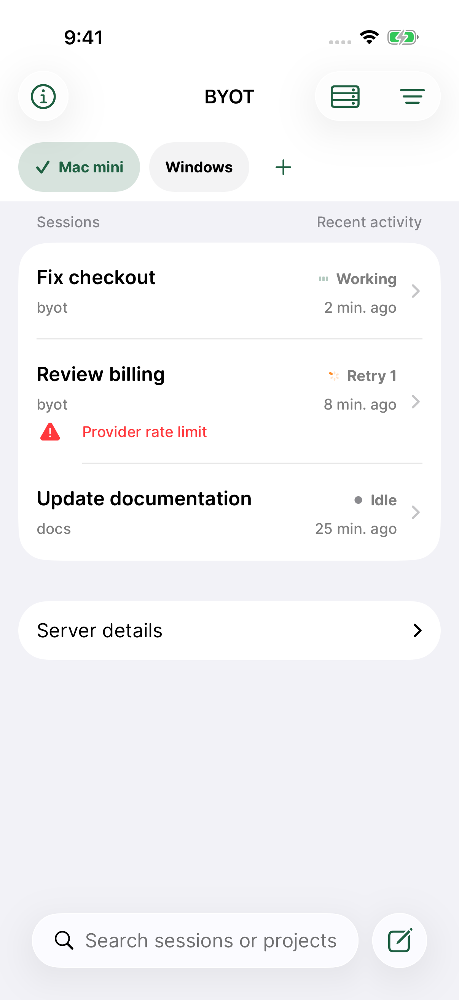
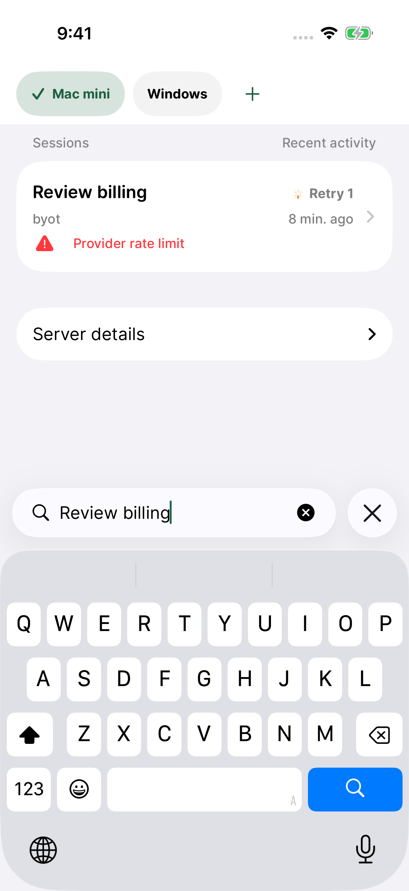
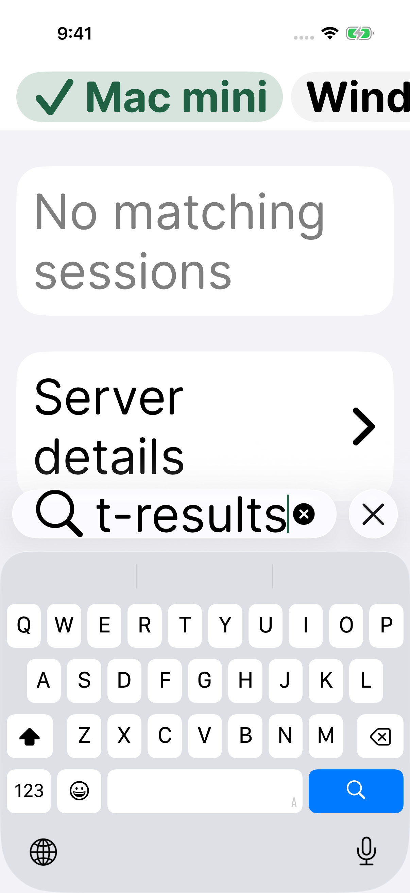

# BYOT 1.0.13 (20260909104300)

September 9 TestFlight feedback `ACeLM70lnaQP34bA5X0e_I0` on 1.0.12 requested moving the search box to the bottom, on the same row as Compose.

On iPhone running iOS 26 or later, session search now uses the system bottom toolbar beside New session. The server bar remains at the top, and filtering still searches session titles, project names, and paths. Earlier iOS versions keep their existing search placement. The implementation uses Apple's [system search toolbar item](https://developer.apple.com/documentation/swiftui/toolbardefaultitemkind/search).

This candidate starts from the verified 1.0.12 release source and records, commit `b378602`. It retains appearance settings, flat/grouped sessions, sorting, deduplication, stalled-session recovery, attachments, and OpenCode 1/2 support. No server or protocol changes are included.

## Validation

All 172 unique tests have passing coverage on iPhone 17 Pro / iOS 26.5: 71 XCTest unit/integration tests, 96 Swift Testing tests, and 5 UI tests. The full run passed 171 tests; its only failure was a test-driver lookup for the old Cancel accessibility label. After correcting that lookup to the native iOS 26 close control and explicitly exercising Clear text, both browser UI tests passed. No production app source changed between the full run and focused rerun. There were zero skipped tests. Exact results and xcresult paths are in [validation.json](validation.json).

The tests verify bottom placement beside Compose, keyboard activation, filtering, clearing and dismissal, direct navigation, grouping, sorting, server switching, and accessibility XXXL. The full run also passed appearance persistence, attachments, and real upstream OpenCode 1.18.29 / OpenCode 2 beta 19271 messaging, reload, and switching using a deterministic local model. The optimized Release simulator build and offline plist/script validation passed. The existing TestFlight metadata preflight reported zero errors, warnings, or blockers.

The feedback device runs iOS 27; physical-device/iOS 27 testing is not claimed.

## Screenshots

