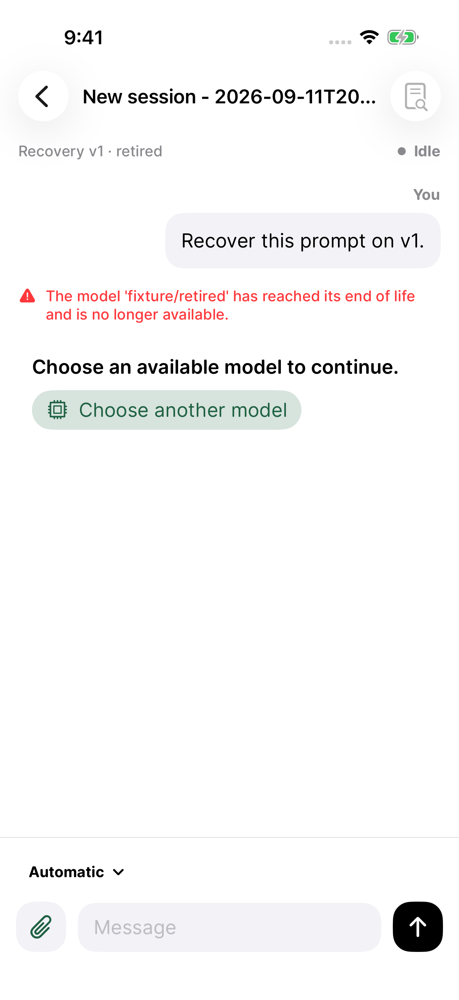
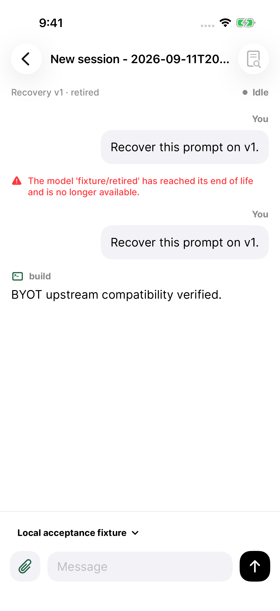
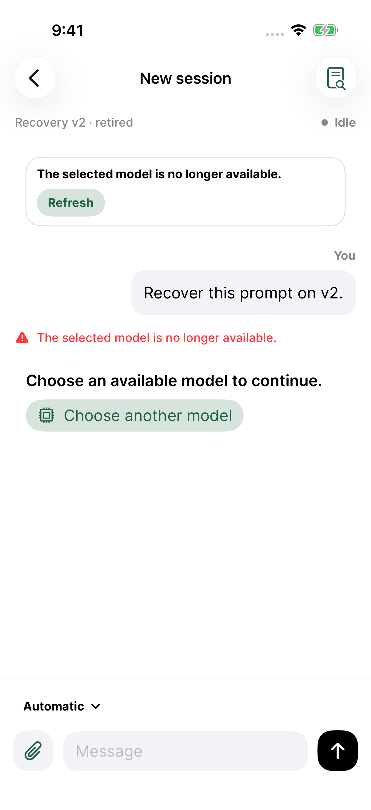
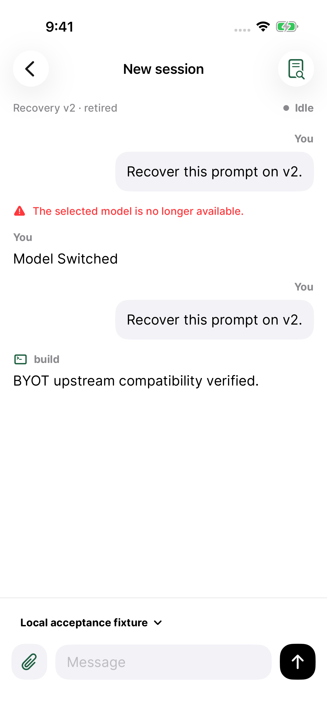
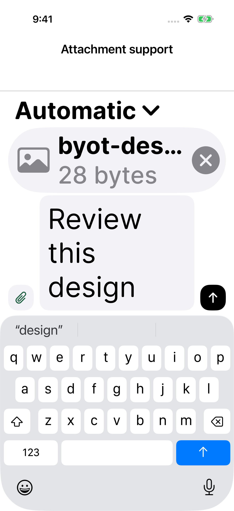
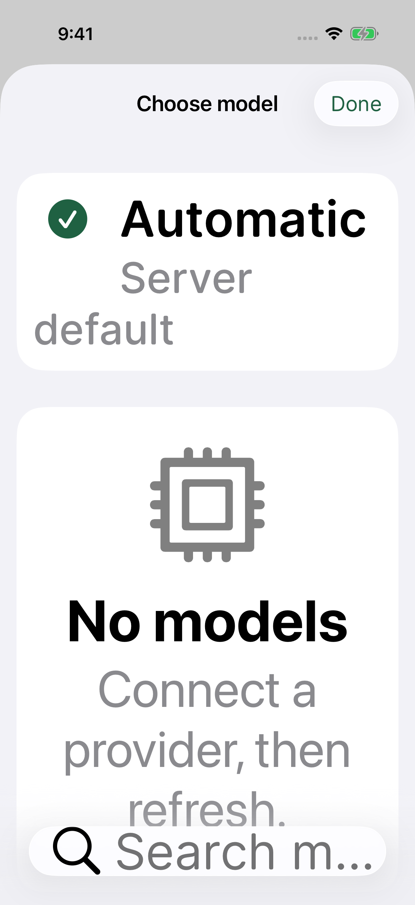

# BYOT 1.0.14 — reliability and accessibility

GitHub milestone: [TestFlight: reliable model recovery and accessible controls](https://github.com/steventsao/byot/milestone/3).

This release addresses #44, #45, #46, #48, and #50. It starts from main `ed39923` and includes the already distributed appearance and session-browser changes from #55/#56 plus the connection service refactor in #57.

## Behavior

- **#44:** Provider error envelopes display their human-readable detail. An unavailable model offers **Choose another model** in the conversation. After an explicit selection, **Retry last message** resends the original text and embedded attachments with a new admission ID. Busy turns, duplicate taps, and turns with assistant output or tool calls cannot use this replay action. Existing unanswered-turn recovery and queued-message behavior remain separate.
- **#48:** At accessibility text sizes, attachment chips use a bounded vertical list. Filenames truncate and removal has a visible target of at least 44 × 44 points.
- **#50:** The Automatic model row and loading/empty/error states share the list's scroll layout; no empty-state overlay covers selectable rows.
- **#45:** The shipped session browser uses the generic **No matching sessions** state. Its regression now uses the reported 139-character query at Accessibility XXXL.
- **#46:** The shipped adaptive surfaces and System/Light/Dark settings are retained. Filled mint buttons now use explicit contrasting text: black in Dark appearance and white in Light appearance. Contrast tests cover shared text/surfaces, composer controls, and filled mint controls in both modes.

## Upstream contract

Live acceptance uses pinned OpenCode **1.18.29** and **2 beta 19271**, production HTTPS and Keychain code, and a deterministic local provider. Each server also has a separate `retired` project whose default model returns HTTP 410. The UI must encounter that failure through Automatic, choose the working model, and receive a response to the retried prompt.

The beta's actual failed assistant projection contains `error: {type: "provider.invalid-request", message: "Provider request failed with HTTP 410", status: 410}`. It omits the provider's response body. BYOT preserves the typed error and status through snapshot and event normalization to offer recovery in this case too.

## Verification

**184 live acceptance/regression tests passed, zero failures or skips:** 71 XCTest tests, 111 Swift Testing tests, and two UI workflows spanning both servers. Run on an iPhone 17 Pro simulator, iOS 26.5 (23F77), Xcode 26.5 (17F42). The UI verified retired Automatic → choose active model → retry original prompt → assistant reply on both protocols, plus ordinary sending, transcript reload, grouping, server switching, and persisted passwords/selection.

The separate serial accessibility run passed **five UI workflows and three contrast tests** (each contrast test ran in both appearances), zero failures or skips, on iPhone 17 Pro simulator, iOS 26.3.1 (23D8133), Xcode 26.3 (17C529). The three contrast tests are also included in the 184-test run. Screenshots were inspected after both runs.

The tests use real pinned upstream servers, production HTTPS/authentication/Keychain, and a deterministic local model. Physical devices and paid model providers were not tested.

| Evidence | Result bundle |
| --- | --- |
| Live protocol and regression acceptance | Mac mini: `/tmp/byot-upstream-e2e.GUAnR3/tests.xcresult` |
| Appearance and Accessibility XXXL | MacBook Air: `/tmp/byot-accessibility.Y77H9h/tests.xcresult` |

Live acceptance used source `89167c7`; accessibility used `ed6c8b4`. Application source has not changed since `55aa432`. Later changes affect test locators, release signing configuration, and documentation. The signed archive was built from `eeb5dce`.

Run again:

```sh
scripts/test-opencode-upstream.sh
scripts/test-ios-accessibility.sh
```

The runners create disposable simulators and run UI tests serially. [Upstream results](upstream-summary.json), [accessibility results](accessibility-summary.json), and [compatibility metadata](compatibility.json) retain the results. The screenshot manifests preserve original attachment names and SHA-256 hashes.

## Screenshots

These are unedited XCTest captures from the passing runs.

| Retired Automatic model | After choosing an active model and retrying |
| --- | --- |
|  |  |
|  |  |

| Accessibility XXXL attachment removal | Accessibility XXXL model picker |
| --- | --- |
|  |  |

[Long-query search](sessions-search-accessibility.png) · [Light appearance](home-Light.png) · [Dark appearance](home-Dark.png) · [Restored server selection](upstream-v2-restored-server-switch.png)

## Release archive and TestFlight

**1.0.14 (20260911130732)** was archived and exported with the existing distribution identity on the Mac mini. Apple validation succeeded with no errors. The signed arm64 IPA contains no test bundles or Debug acceptance fixtures. SHA-256: `e4f8b17a4457feb35bffeaf67786d440626318b034a27e12230bdc128f744fdf`.

The release runner now accepts `BYOT_CODE_SIGN_IDENTITY` and `BYOT_PROVISIONING_PROFILE_SPECIFIER` for a distribution-only keychain. This build uses a matching App Store profile and a manual export-options plist; automatic development signing cannot use a distribution-only keychain. No certificates were revoked or private keys exported.

Upload to **Internal Testers** is in progress. The milestone stays open until App Store Connect reports the build valid and available to the group. External beta review has not been requested.
