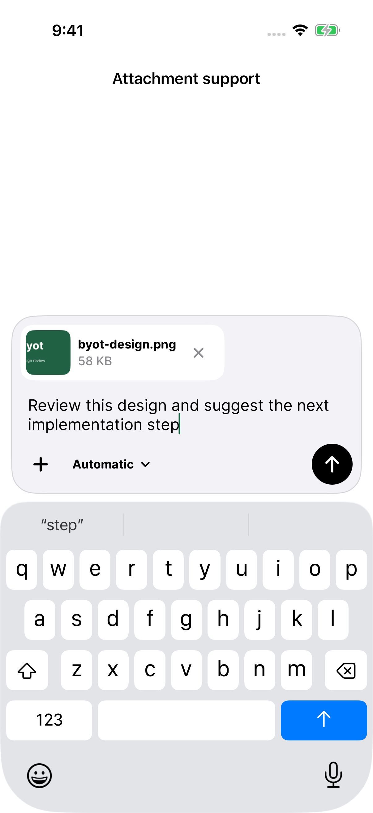
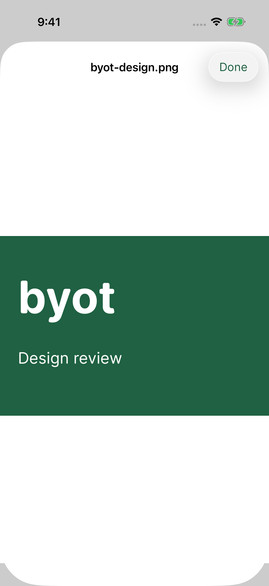
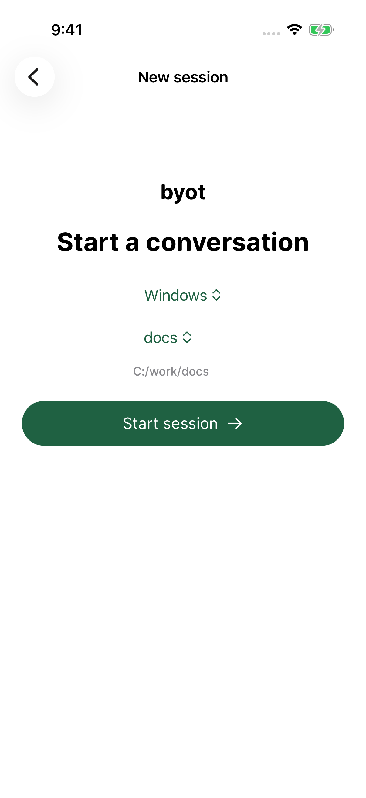
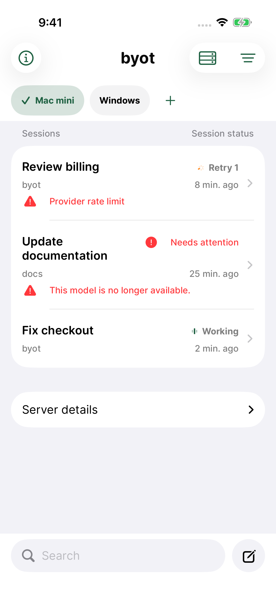

# byot 1.0.15 — input, previews, and session navigation

The composer now keeps its message, attachment previews, model choice and send/stop control in one rounded container. Image and document previews preserve the draft, and attachment-only prompts can be queued while a turn runs. Search and compose share the bottom row of the session browser.

New conversations choose their server and project on a dedicated page, with an optional working directory. The server picker aligns selected and unselected names, Edit server receives the selected saved profile, and the server bar occupies the top safe-area inset. The app icon and in-app lowercase wordmark use the bundled Open Runde font.

Terminal errors observed in a conversation are retained in that server's session list and participate in status sorting. Known failures are reconciled against the server when browsing resumes; ordinary browsing does not download every session's transcript. Thinking/working transcript activity uses an animated glyph with an accessibility description.

The [feedback audit](../../testflight-feedback-audit.md) accounts for all 55 screenshot reports and both historical voice-permission crash reports. Removed hosted-agent, Apple sign-in, Flue and voice features are identified as retired code paths.

## Verification

The upstream run passed **188 unit/regression tests** (71 XCTest and 117 Swift Testing) plus the normal live connection/sending/reload/server-switch workflow. The recovery workflow was terminated with SIGTERM during that invocation; its focused rerun passed on both OpenCode versions. These are **190 distinct completed checks across two invocations**, not a single uninterrupted green run. Both original result summaries are retained.

| Invocation | Source | Result bundle | Recorded result |
|---|---|---|---|
| Upstream and full regression | `63ebe2a` | Mac mini: `/tmp/byot-upstream-e2e.4QvY6L/tests.xcresult` | [189 passed, one terminated](upstream-summary.json) |
| Focused model recovery | `2640d3a` | Mac mini: `/tmp/byot-upstream-e2e.eVM70Z/tests.xcresult` | [One passed](recovery-summary.json) |
| Local appearance, attachments and browsing | `7262d16` | MacBook Air: `/tmp/byot-accessibility.YeKZBK/tests.xcresult` | [17 passed, two failures requiring follow-up](accessibility-summary.json) |
| Focused appearance and navigation | `a936d51` | MacBook Air: `/tmp/byot-accessibility.fJTAjc/tests.xcresult` | [Five passed, one server-tap failure](navigation-summary.json) |
| Same grouped/relaunch/server-switch workflow | `a936d51` | Mac mini: `/tmp/byot-accessibility.l9DG0a/tests.xcresult` | [One passed](server-tap-summary.json) |

All **19 distinct appearance/attachment/navigation checks** have a passing run across the listed simulators: nine unit/contrast tests and ten UI workflows. Coverage includes actual preview pixels/text, draft preservation, filename confinement and cleanup, Accessibility XXXL removal/model selection/search, saved-profile editing, inline server/project selection, custom directories and persisted terminal errors. Appearance tests sample rendered pixels through settings changes and relaunch.

**Runtime limitation:** the local iOS 26.3 simulator repeatedly missed a server-bar tap after relaunch in grouped view. The exact unchanged test passed on iOS 26.5. A separate local simulator also failed standalone app launch without returning a process handle. This does not prove the cause of the tap failure; physical-device confirmation remains unavailable. The older-runtime failure is retained here rather than reported as an uninterrupted green run.

Real upstream versions are pinned to **OpenCode 1.18.29** and **OpenCode 2 beta 19271**. Tests use production HTTPS, authentication and Keychain with a simulator-scoped certificate and a deterministic local model. Live tests ran on iOS 26.5 (23F77), Xcode 26.5 (17F42); local UI tests use iOS 26.3.1 (23D8133), Xcode 26.3 (17C529), both on iPhone 17 Pro simulators. Physical devices, paid providers and a live Windows host were not tested. Windows-style project paths and minimal v2 health are covered by fixtures.

The final application source is `a936d51`. It differs from live acceptance only in the server bar's layout/hit area, DEBUG browser fixtures and test/runner updates; focused navigation checks cover that layout change. Browser fixtures validate navigation and Windows-style paths, and can display a reconnect banner because they do not supply a real persistent upstream stream. The real upstream workflows above separately verify event transport. Raw tester screenshots and private App Store Connect data are not included. The PNGs below are unedited XCTest captures; the accompanying `*-screenshots.json` files retain their original names and SHA-256 hashes.

## Screenshots

| Composer | Native image preview |
|---|---|
|  |  |

[Document preview](preview-review-notes.png) · [Largest text size](attachment-largest-text.png) · [OpenCode 2 recovered reply](v2-recovered-with-active-model.png)

| Inline new-conversation context | Session-list error |
|---|---|
|  |  |

## Distribution

**1.0.15 (20260911144503)** was archived from `a936d51` using the existing distribution identity and provisioning profile. Apple validation and signature verification passed. The arm64 IPA contains no test bundles or DEBUG acceptance markers. SHA-256: `39dfd265ecfd41d33fb555811446eac3a546d775a6408ef99a8a559616a585d0`.

Internal TestFlight processing and the distribution receipt are pending. [Compatibility and archive metadata](compatibility.json).
