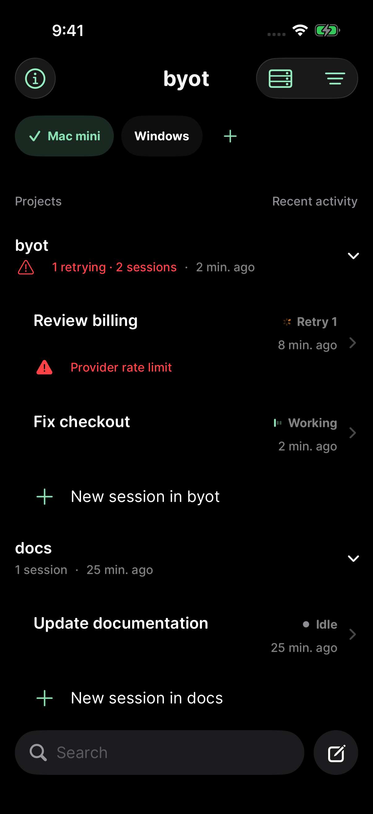
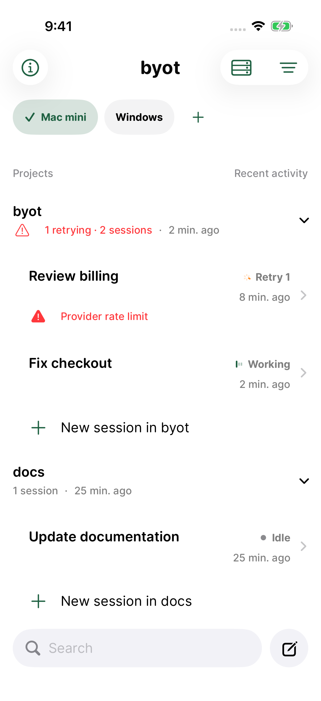

# byot 1.0.16 — seamless project and session lists

Projects and sessions now sit directly on the app canvas. Plain lists, transparent rows, and hidden separators remove the gray grouped-list box. Dark Mode is black; Light Mode retains the system background. The recent-session browser, expanded project groups, and project session list share this treatment.

The application source is `a3a36e35713d56f9cc4ac6251aaab8b8e212bc91`, based on the released 1.0.15 main branch. Later commits contain release evidence only.

## Verification

| Appearance / simulator | Result |
| --- | --- |
| Dark, iPhone 17 Pro / iOS 26.5 | [18 checks passed](dark-summary.json): 13 browser/appearance tests and five UI workflows; parameterized tests produce 21 executions. |
| Light, iPhone 17 Pro / iOS 26.3.1 | [17 passed, one failed](light-ios26.3-summary.json). Recent sessions, grouping, sorting, server switching, direct navigation, saved-profile editing, errors and large-text search passed. The New Session button tap did not open its destination. |
| Light, iPhone 17 Pro / iOS 26.3.1, focused rerun | [New-session workflow passed unchanged](light-ios26.3-rerun-summary.json). |
| Light, iPhone 17 Pro / iOS 26.5 | [Both focused workflows passed](light-ios26.5-summary.json): grouping/sorting/server switching/direct navigation and new-session server/project selection. |

The older-runtime New Session failure is retained rather than describing the runs as one uninterrupted pass. The same test passed unchanged in a fresh local simulator. All 18 distinct checks therefore have passing runs in both appearances, across the documented invocations; the initial missed tap remains an intermittent test limitation. Physical-device behavior was not tested. These are fixture-backed UI checks; upstream OpenCode transport was not changed or rerun for this visual update.

Unedited screenshots below verify the recent-session and project-group layouts. [Pixel samples](background-samples.json) match the canvas: RGB 0/0/0 in Dark Mode and 255/255/255 in Light Mode. Original screenshot names and SHA-256 hashes are recorded in the [Dark](dark-screenshots.json) and [Light](light-screenshots.json) manifests.

| Dark | Light |
| --- | --- |
|  |  |

[Recent sessions, Dark](sessions-recent-dark.png) · [Recent sessions, Light](sessions-recent-light.png) · [Largest text](sessions-accessibility-dark.png) · [Large-text search](sessions-search-accessibility-dark.png)

## Distribution

**1.0.16 (20260911160436)** is **VALID** and **IN_BETA_TESTING**, with explicit membership in **Internal Testers** and matching English release notes. Apple validation and signature verification passed. The arm64 IPA contains no test bundles or DEBUG fixture markers. SHA-256: `838d2959240622baac8ddfed351af9dcb9b190a792caf6b81bc908f020d76d71`.

[Verified TestFlight receipt](testflight.json). External beta review was not submitted.
