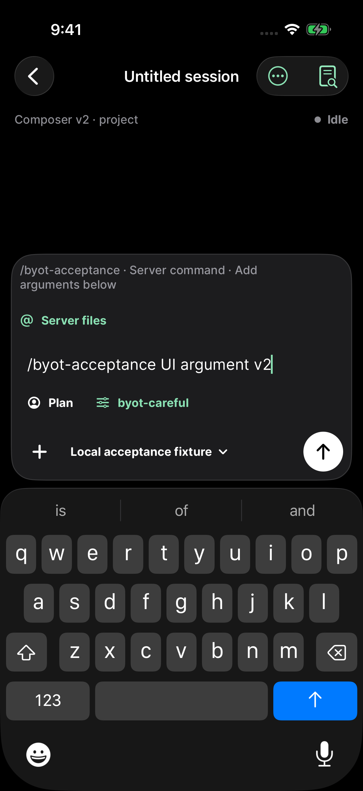
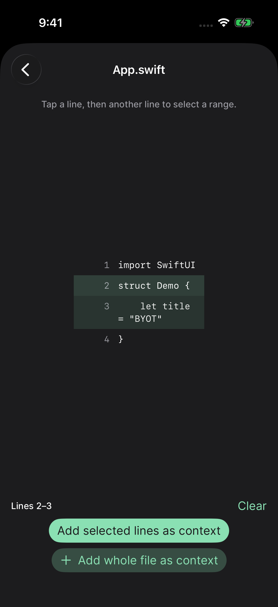

# byot 1.0.17 — everyday OpenCode controls

The iPhone client now includes the seven prioritized everyday features:

| Issue | Delivered behavior |
| --- | --- |
| [#6](https://github.com/steventsao/byot/issues/6) | Advertised slash commands, app actions, and primary-agent selection. |
| [#62](https://github.com/steventsao/byot/issues/62) | Advertised model variants, with prompt settings retained through queue dispatch and supported retries. |
| [#5](https://github.com/steventsao/byot/issues/5) | Server file browsing, `@` search, bounded previews, file context, and supported source-line selections. |
| [#4](https://github.com/steventsao/byot/issues/4) | Undo/redo, compaction, and forks; queued prompts pause for review when history changes. |
| [#2](https://github.com/steventsao/byot/issues/2) | Session details, rename/delete, child navigation, and fork-source navigation. |
| [#3](https://github.com/steventsao/byot/issues/3) | Server-reported task progress, with explicit stale and unavailable states. |
| [#51](https://github.com/steventsao/byot/issues/51) | Native selection and copying of arbitrary response or code ranges. |

The release application source is `faf55b4070564244c67e5230d140e9fdfd49318e`. Later commits contain UI test synchronization and release evidence; application sources are unchanged.

## Server compatibility

Controls follow the negotiated server schema. Supported OpenCode 1 releases trim file previews, so the client offers whole-file context instead of inaccurate source-line ranges. Their changed-file endpoint returns a constant empty array; the client reports that operation as unavailable. OpenCode 2 uses exact file bytes and supports changed-file status and line context.

OpenCode 2 undo changes conversation history without rolling back workspace files. Its current beta has no task snapshot route, so progress remains unavailable until an actual update arrives. Retained task updates become stale after disconnection. See the [file contracts](../../features/server-file-context.md) and [session contracts](../../features/session-essentials.md).

## Verification

Acceptance uses isolated HTTPS OpenCode **1.18.29** and **2 beta 19271** servers with a deterministic local model and a temporary Git workspace. It exercises the production transport, command dispatch, model variants, file references, lifecycle and history operations, and response recovery without using a paid model or a user's workspace.

| Run — iPhone 17 Pro / iOS 26.3.1 | Result |
| --- | --- |
| Light, full unit/API suite and feature UI | [238 passed, one failed](light-summary.json). The complete v1/v2 connection, send, reload, server switching, and retired-model recovery flows passed. The composer flow stopped when the test replaced only part of the long v2 session title. |
| Dark, full unit/API suite, new controls, and session browser | [241 passed, two failed](dark-summary.json), including the new stale-rename regression. All five session-browser workflows passed. The `@` test failed before typing because its initial tap did not focus the field; the composer test stopped because a native long press did not open the requested edit menu. |
| Dark, final composer regression suite and corrected `@` interaction | [14 passed](dark-focused-summary.json). Includes direct inherited-model changes, per-model reasoning preferences, explicit Default, and native keyboard-focus synchronization. |
| Dark, final file workflow and complete live composer flow | [Both passed](dark-final-ui-summary.json). File browsing, reading, line context, removal and sending; slash commands, agents, variants, saved rename, task views, undo and redo on both real server versions. Includes the final selected-lines button contrast correction. |

All runs have zero skipped checks. Initial automation failures are retained in the evidence instead of describing these separate invocations as one uninterrupted pass. Feature assertions were preserved while the tests gained focus checks and native Select All keyboard input.

An [intermediate composer-only rerun](dark-composer-intermediate-summary.json) also stopped when the Session details menu did not open while the command was still finishing. The final test waits for the turn to finish and verifies that a menu has opened before choosing an action.

The simulator runtime is missing `AppleColorEmoji.ttc`, producing emoji boxes in both the original transcript and native selection sheet. Exact Unicode clipboard equality still passes; [the runtime diagnostic](simulator-font-diagnostic.txt) records the missing font. This does not verify physical-device typography.

Unedited screenshots and hashes are linked in the [Light](light-screenshots.json), [Dark](dark-screenshots.json), and [final](final-screenshots.json) manifests. File screenshots use deterministic component fixtures; separate acceptance tests exercise actual server file APIs. The final selected-lines action measures [10.85:1 contrast](final-reader-contrast.json).

| Live OpenCode 2 composer | Selected server-file lines |
| --- | --- |
|  |  |

Physical-device HTTPS/Tailscale and intended-provider acceptance remain open in [#18](https://github.com/steventsao/byot/issues/18).

## Distribution

**1.0.17 (20260912020541)** is **VALID** and **IN_BETA_TESTING**, with explicit membership in **Internal Testers** and matching English release notes. The [TestFlight receipt](testflight.json) records build `53ff37cf-ae30-4739-a841-166b5c97e366` and the individual App Store Connect checks. External beta review was not submitted. The existing App Store 1.0.15 submission remains waiting for review.

Apple archive validation, archive/IPA signature checks, and arm64 verification passed. The exported IPA contains no XCTest bundles, private keys, or DEBUG fixture markers. See the [artifact verification](release-verification.json). IPA SHA-256: `db2606b379a717517afb14348a622e41263fee79b47f88f66e2dcf685066a888`.
