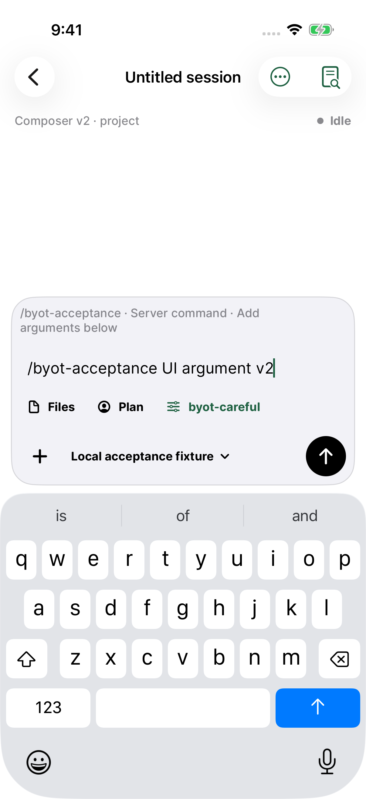
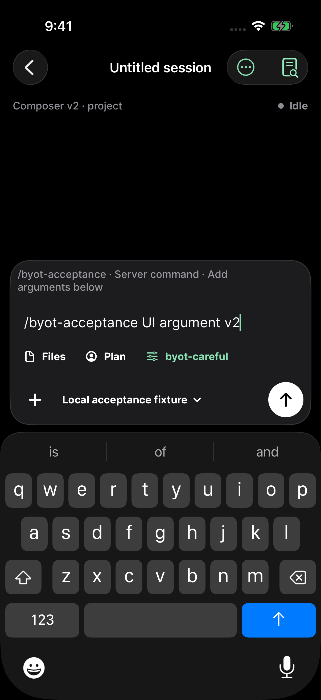

# byot 1.0.18 — compact composer controls

**Files** now uses a document icon and sits beside the agent and variant controls below Message, addressing the TestFlight feedback on 1.0.17. The controls row scrolls horizontally when text needs more space. Opening Files dismisses the keyboard and presents the existing file picker; selected context and @ suggestions keep their existing state.

**1.0.18 (20260912092708)** is **VALID** and **IN_BETA_TESTING**, with explicit membership in **Internal Testers** and matching English release notes. The [TestFlight receipt](testflight.json) records build `badab880-0db2-452a-b5d8-981416bd30b2` and six independent App Store Connect checks. External beta review was not submitted.

The release application source is `5b4fa554be8c93c6821ff968f14d21ec6b75a02d`. Later commits contain UI-test navigation and menu-opening synchronization and release evidence; application sources are unchanged.

## Verification

Tests ran serially on iPhone 17 Pro / iOS 26.3.1 simulators. Live acceptance used isolated HTTPS OpenCode **1.18.29** and **2 beta 19271** servers, a deterministic local model, and temporary Git workspaces.

| Run | Result |
| --- | --- |
| [Initial Dark](dark-interrupted-summary.json) | Three passed: file browsing/reading, line selection, context removal/sending, @ context with draft preservation, and largest-text attachment removal. The live test completed v1 and v2 sending/rename, then was manually canceled after repeated 60-second XCTest animation-completion waits. |
| [Dark navigation retry](dark-navigation-failure-summary.json) | Full v1 workflow completed; the test failed when a Back tap left the conversation visible. The test now scopes Back to the exact conversation, verifies the browser destination, and retries one missed navigation tap. |
| [Light live and appearance](light-composer-summary.json) | Two passed: complete v1/v2 agent/variant selection, slash-command sending, rename, tasks, undo/redo and browser navigation; largest-text attachment removal. The regular attachment screenshot test failed when its menu-opening tap did not open the menu. |
| [Light attachment rerun](light-attachment-summary.json) | Passed with a hittable-opener check and one bounded retry of a missed opening tap. Attachment selection, disappearance, and screenshot assertions are preserved. |

All selected workflows passed in their final relevant invocation; the table retains earlier failures and cancellation rather than presenting separate runs as one uninterrupted pass. The [interruption diagnostic](dark-interruption-diagnostic.txt) records the animation waits; their underlying cause is not established. Test synchronization changes preserve every feature assertion.

Original screenshots were visually reviewed in both appearances: Files has the document icon below Message, beside Plan and byot-careful, with no overlap above the keyboard. The largest-text attachment fixture remains usable; it has no agent/variant catalog, so it does not independently establish the combined row at the largest text size. The [Dark](dark-screenshots.json), [Light](light-screenshots.json), and [final attachment](light-attachment-screenshots.json) manifests record original filenames and SHA-256 hashes. Screenshots use isolated fixtures; the private TestFlight feedback image is excluded.

| Live OpenCode 2 / Light | Live OpenCode 2 / Dark |
| --- | --- |
|  |  |

The signed archive and IPA passed Apple validation and independent metadata, strict signature, arm64 and package checks. See the [artifact verification](release-verification.json). IPA SHA-256: `c71f1ea0bf398aee9423b36caf0d527ee10021f4f5304bb3a889710c20c2b388`.
