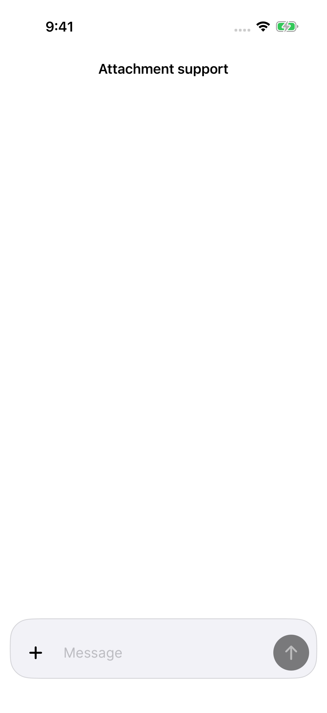
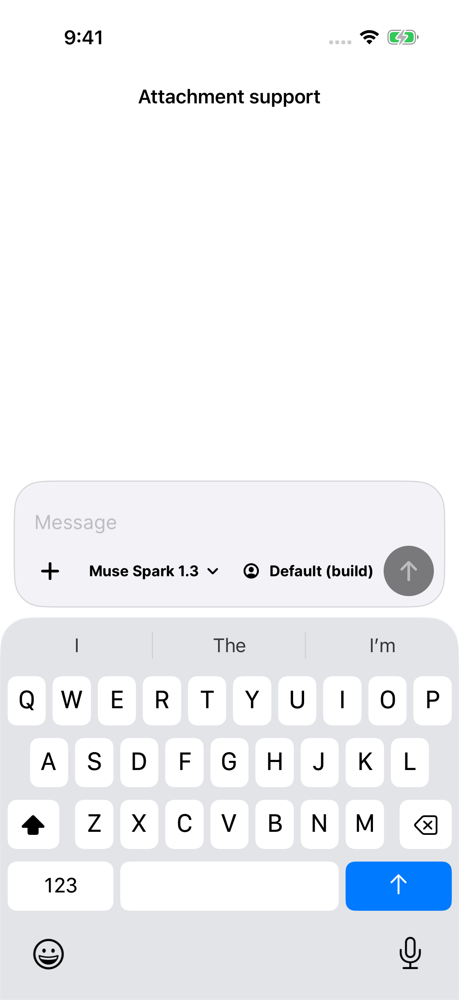
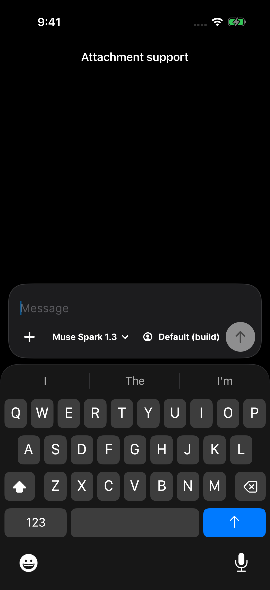

# byot 1.0.21 — the composer minimizes on send

Sending a message now folds the composer back to a single row — add, Message, send — with one smooth native animation, instead of holding the full keyboard-height panel open. Tapping Message expands it again. This answers the TestFlight report submitted against 1.0.20.

The knobs are one row. Add, model, agent, and effort lead the row under the message and send stays at its trailing edge; the row scrolls horizontally when the labels are long. **Files** moved into the **+** menu beside Choose Photo and Choose File, so the composer no longer carries two control rows. The effort control is neutral instead of mint.

| Report | Build | Disposition |
|---|---|---|
| `AOZmN-SID8Bh11kUI4sRAT0` — minimize the input on send, like ChatGPT | 1.0.20 (20260914020034) | Implemented; UI verified |
| `AP61hUE2AovmmO2zq7no_hg` — Files in the plus dropdown, effort and agent in the same bottom row as the input's knobs | 1.0.19 (20260912224718) | Implemented; UI verified |
| `AFLln8T3hkHG3FFblK9JN0k` — composer controls should not be green | 1.0.19 (20260912224718) | Completed here; 1.0.20 neutralized the toolbar chrome, the effort control is neutral in this build |
| `AL5ZLFDrP5s2cxxhF8izJ2M` — word alignment in a session-list transition state | 1.0.19 (20260912224718) | Open; not part of this composer change |

## Verification

All runs used iPhone 17 Pro simulators on iOS 26.3.1 (23D8133), Xcode 26.3 (17C529), serially, from `scripts/test-ios-accessibility.sh`.

| Run | Result |
| --- | --- |
| [Unit, appearance, browser, server files](regression-summary.json) | 236 passed, 0 failed, 8 skipped. The eight skips are the opt-in live-server tests, whose isolated OpenCode servers were not running. |
| [Composer, Light](composer-summary.json) | 7 passed: collapse/expand and the add menu, the single control row, largest-text control reachability, attachment previews and removal, and the model picker. |
| [Composer, Dark](dark-summary.json) | The same 7 passed with the simulator in Dark Mode. |

An earlier invocation of the first run failed `BYOTAppearanceUITests/testAppearanceChangesImmediatelyAndPersists` when a menu tap on the appearance picker did not open the menu — the same intermittent simulator menu-tap failure recorded in earlier releases. The unchanged test passed in the run above; the failure is retained here rather than presented as one uninterrupted green run.

The composer checks assert behavior, not just presence: an untouched composer exposes no model, agent, or effort control and no separate Files button; the add menu opens the server file browser; focus reveals the knob row under the message; sending removes the knob row, restores the Message placeholder, and returns the field to its launch height. `composer-collapsed.png` and `composer-collapsed-after-send.png` are byte-identical (SHA-256 `2fddb05e…`), so the composer returns to exactly its starting row.

The single control row is verified with a real agent and effort catalog. A `--composer-catalog` DEBUG launch argument seeds the screenshot harness with agents and a model variant, which closes the gap recorded in the [1.0.18 report](../1.0.18/README.md), where the harness had no catalog. Every knob shares the send control's row and sits under the message; at Accessibility XXXL the controls stack and stay inside the screen with a hittable send.

Screenshot manifests with original names and SHA-256 hashes: [Light](light-screenshots.json), [Dark](dark-screenshots.json). Physical devices, live OpenCode servers, and paid providers were not exercised in this run; the composer's send path against real servers remains covered by `scripts/test-opencode-upstream.sh`, which was not run for this change.

| Idle composer | Sending it back to one row |
|---|---|
|  |  |

| One control row, Light | One control row, Dark |
|---|---|
|  |  |

[Add menu with Server Files](composer-add-menu.png) · [Expanded composer](composer-expanded.png) · [Largest text size](composer-controls-largest-text.png)
