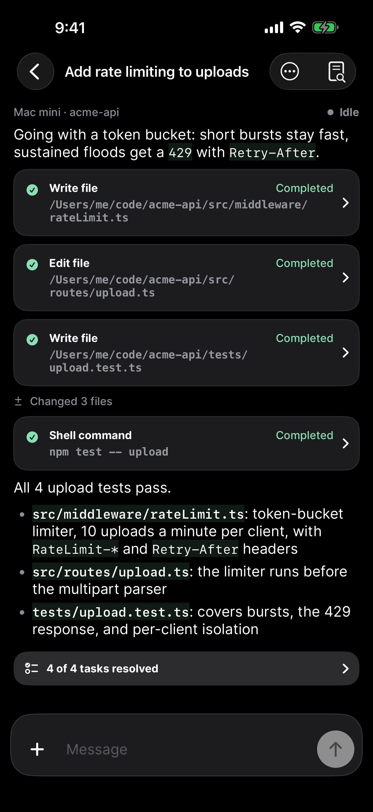
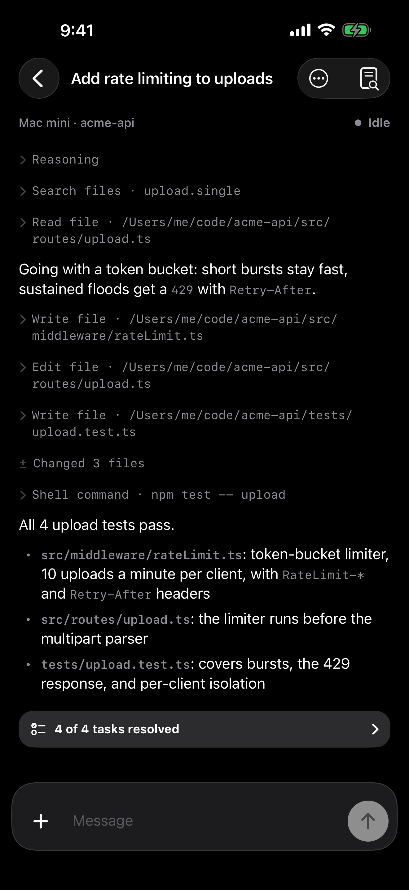
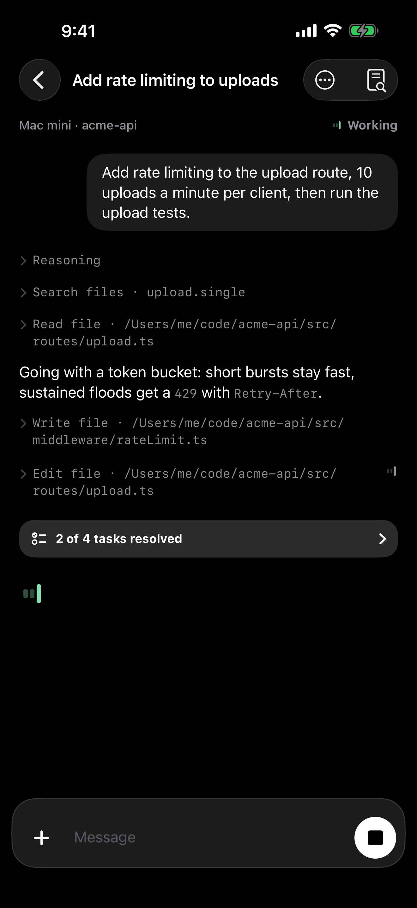
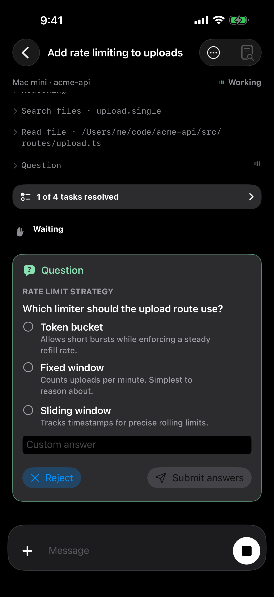

# byot 1.0.22 — OpenCode type and spacing

The app now sets type the way OpenCode does. Prose and controls use the platform sans (OpenCode's `system-ui` stack) at 16pt body and 13pt small, and tools, inline code, and code blocks use the platform monospace (`ui-monospace`). This answers a direct request, sent with a screenshot of an OpenCode transcript, that byot's font and spacing match OpenCode. Only the byot wordmark and app icon keep Open Runde.

The transcript follows the same reference:

- Tool calls are one quiet monospace row, `› Write file · path`, instead of bordered cards with a green Completed label. A leading chevron opens the input and output; only running, queued, or failed calls show a status. Reasoning uses the same row.
- Replies run full width with no "You" or agent headers. The prompt is a trailing pill, and VoiceOver still names each message's author.
- Inline code is dim monospace instead of a mint chip. Prose gets 2pt of extra leading, 12pt between blocks, and 20pt between turns and at the screen edges.

| Before, 1.0.21 | After, 1.0.22 |
|---|---|
|  |  |

| Live turn | Question pending |
|---|---|
|  |  |

## Verification

Simulators ran iOS 26.5 (23F77) under Xcode 26.5.

| Run | Result |
| --- | --- |
| [Unit, appearance, composer, session browser, server files, text selection](regression-summary.json) — `scripts/test-ios-accessibility.sh` on iPhone 17 Pro, Light | 245 passed, 0 failed, 8 skipped. The skips are the opt-in live-server tests, whose OpenCode servers were not running. Swift Testing: 133 tests in 18 suites passed. |
| App Store screenshot fixture — `scripts/capture-app-store-screenshots.sh iphone-6.9` on iPhone 17 Pro Max, Dark | Passed; all six phases captured. Three are kept here ([hashes](screenshots.json)). |

The first capture of this change showed single-line tool rows spaced wider than wrapped ones, because of a minimum row height, and the "Changed 3 files" glyph out of line with the chevrons. Both were fixed, and every run above is against the fixed tree.

Not covered: the transcript in Light Mode (the Light run exercised the composer and lists, not a transcript), iPad, physical devices, and live OpenCode servers. The App Store screenshot set in `docs/app-store` still shows the 1.0.21 type and was not reshot.
