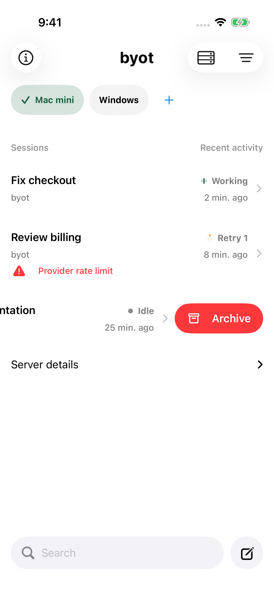
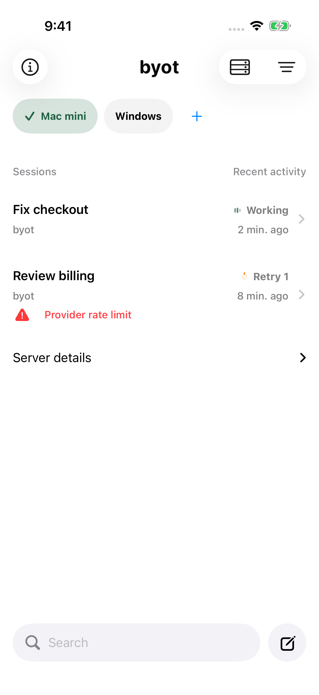

# byot 1.0.23 — swipe to archive a session

Swipe a session left in the session list to reveal a red, horizontal Archive pill, then tap it to archive the session. This answers a direct request, sent with a screenshot of another app's session list, followed by "Make it red cause it's destructive and a horizontal pill."

- The pill is the archive icon beside the title, in system red. iOS 26 system swipe actions draw a round button with the title underneath, and in testing they ignored the red tint, so each row uses its own horizontal drag. Vertical drags still scroll the list, one row stays open at a time, tapping an open row closes it, and VoiceOver offers Archive as a row action.
- Archiving removes the row immediately and sends `PATCH /session/<id>` with `time.archived` in milliseconds, the same call OpenCode's own app makes. If the request fails, the row returns and the error appears in the list banner.
- On a real OpenCode 1.18.29 server the PATCH returned 200 and stamped `time.archived`, but the default session list still returned the session. The session browser filters archived sessions, including from a load already in flight when the session was archived.
- OpenCode 2 beta-19271 has no archive route: `PATCH /api/session/<id>` and `POST /api/session/<id>/archive` both returned 404, and its schema lists no archive operation. Sessions on v2 servers do not offer the swipe.

| Swiped open | After archiving and refreshing |
|---|---|
|  |  |

## Verification

Simulators ran iOS 26.5 (23F77) under Xcode 26.5.

| Run | Result |
| --- | --- |
| Unit tests on the release tree — `xcodebuild test -only-testing:BYOTTests`, iPhone 17 Pro | Swift Testing: 135 tests in 18 suites passed. XCTest: 103 run, 0 failures, 8 skipped (the opt-in live-server tests). New tests cover the v1 archive request and the v2 unsupported path, and an archived session staying hidden while a reload still lists it. |
| [Session browser UI](session-browser-summary.json) — `scripts/test-ios-accessibility.sh -only-testing:BYOTUITests/OpenCodeSessionBrowserUITests`, iPhone 17 Pro, Light | 6 passed, 0 failed. The new test swipes a row, asserts the Archive button is more than 1.5 times as wide as it is tall, archives, pulls to refresh, and asserts the row stays gone. [Screenshot hashes](screenshots.json). |
| Real servers — pinned `scripts/e2e/fixtures.py` servers, requests sent with Python | OpenCode 1.18.29: PATCH 200 with `time.archived` set. OpenCode 2 beta-19271: 404 for both candidate routes. |

Two earlier attempts did not ship. System swipe actions rendered a blue, round button. The first custom pill failed its UI test because the hidden pills on closed rows were still exposed as Archive buttons; the pill now exists only while a row is revealed.

Not covered: physical devices, iOS 27, the pill in Dark Mode, and archiving through the app against a live server (the API was checked directly, the UI against the fixture).

This build also includes commit `1862d23`, a test-only change that asserts sent prompts stay visible on real OpenCode servers. TestFlight report `ASC-AKKKHLpgDKdbfusZeotHt7Y` (empty prompt bubble on 1.0.22) did not reproduce on either real server under iOS 26.5 and is not addressed in this build.
