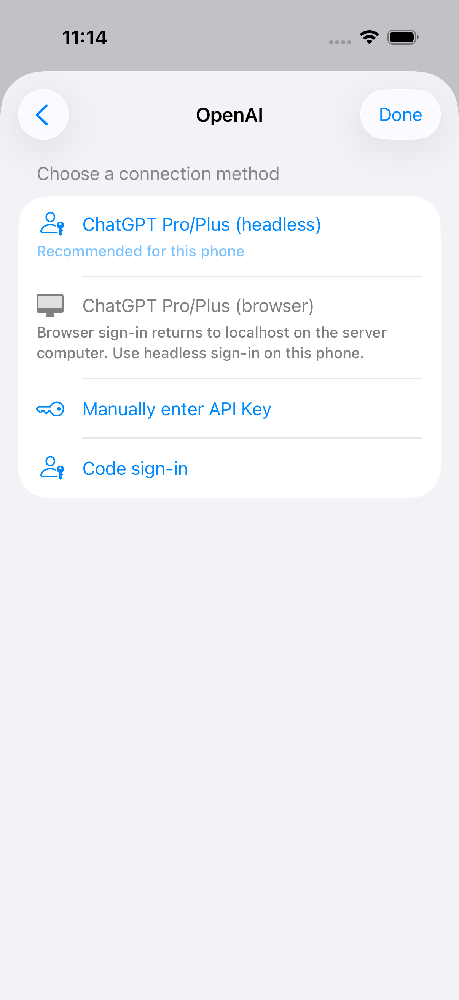
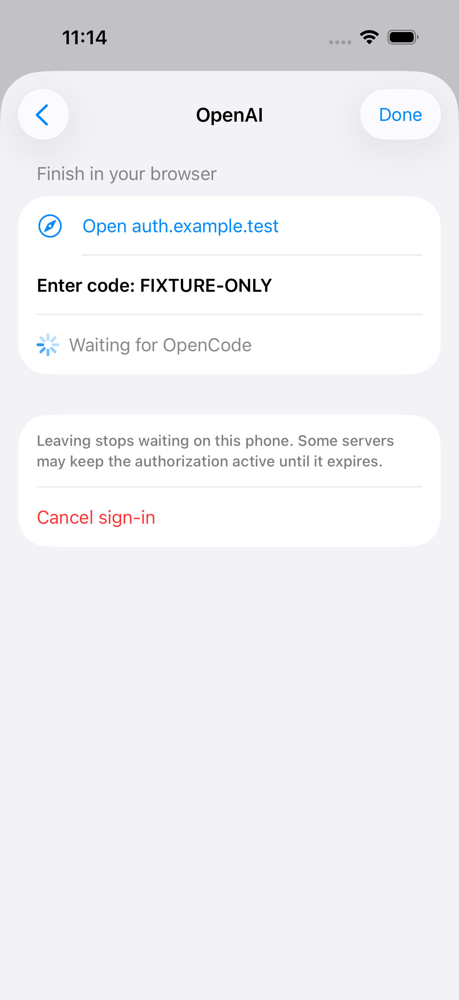
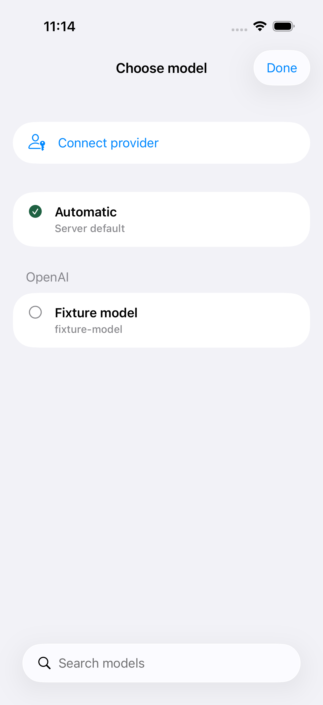

# byot 1.0.24 — provider authentication

> Withdrawn September 18, 2026 at the product owner's request. Issue #7 is deferred and PR #72 is closed without merging. This build was removed from Internal Testers; [1.0.25](../1.0.25/README.md) restores the prior provider experience. The evidence below records the original release.

Issue [#7](https://github.com/steventsao/byot/issues/7) adds Connect provider to the session list and model picker, including an empty picker. The app loads methods and conditional prompts from the selected server, supports API keys and code/automatic OAuth, recommends ChatGPT headless sign-in, and explains why OpenAI's localhost browser callback cannot finish on a remote phone. Completion refreshes the model catalog; errors, cancellation, expiry, and returning from the browser remain recoverable. Credentials are sent through the existing authenticated transport and are not saved in preferences or logged.

Application source commit: `cbaef81bc7d8b00466b3ec461ab80337fbc9fd12`.

The release preserves the latest shipped 1.0.23 code (`c7a475d`) and its release records through `fb19e16`, including typography and swipe-to-archive. [Protocol contracts and manual acceptance](https://github.com/steventsao/byot/blob/cbaef81bc7d8b00466b3ec461ab80337fbc9fd12/docs/opencode-provider-authentication.md) document the v1/v2 differences and schema gating.

## Verification

Tests ran on iOS 26.3.1 simulators with Xcode 26.3. The distribution archive was built with Xcode 26.5.

- [Initial full unit regression](unit-summary.json): 253 passed, 0 failed, 8 opt-in tests skipped. This preceded the final foreground/expiry state cases and tap-area fixes.
- [Final focused run](provider-auth-summary.json): 29 passed, 0 failed, 0 skipped — 25 service/state/policy tests, two live-server tests, and two UI tests. Live servers are isolated OpenCode 1.18.29 and v2 beta 19271 with synthetic credentials. A v1 plugin exercises wrong-code retry and successful OAuth completion. UI fixtures cover empty-picker entry, rejected-key retry, model refresh, device instructions, and background/foreground completion.
- [Apple validation](apple-validation.txt): `VERIFY SUCCEEDED with no errors`.
- [Archive verification](release-verification.json): strict signature verification, arm64, version/build metadata, no XCTest bundles or signing keys, no DEBUG auth fixture markers, IPA SHA-256, and hashes of every source file. All 117 archived source files matched the local implementation before upload.
- `git diff --check`, Python fixture compilation, JavaScript fixture syntax, and release shell syntax passed.

Earlier UI runs exposed a fixture initializer error and untappable blank portions of provider/Connect rows; these were corrected. Screenshot review also prompted a more legible explanation for the unavailable browser method.

Not covered: real ChatGPT account authorization, a prompt using that account, physical-device Safari handoff, or older iOS versions. A tester must complete the real-account acceptance from TestFlight; synthetic tests do not establish that result.

## Screenshots

Screenshots below use DEBUG fixtures and synthetic codes only.

| Methods | Device code | Models after connection |
| --- | --- | --- |
|  |  |  |

## Distribution

**Available to Internal Testers:** 1.0.24 (20260918110000), build `cf74a71b-fd2a-41b9-82d8-5432ff6a6716`. Uploaded September 18, 2026 from application commit `cbaef81`. Apple processing finished as `VALID`, internal state is `IN_BETA_TESTING`, and explicit membership in Internal Testers is independently verified. The en-US What to Test notes match `asc/testflight-notes.md`. App Store release and external beta review were not submitted.

Receipts: [publish](testflight-publish.json), [build](app-store-connect-build.json), [beta state](beta-detail.json), [group membership](beta-groups.json), [notes](testflight-notes.json). Implementation and release evidence are in [draft PR #72](https://github.com/steventsao/byot/pull/72).
