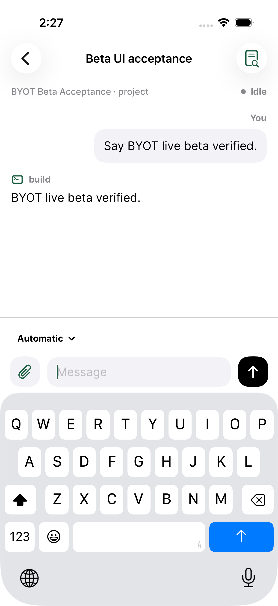
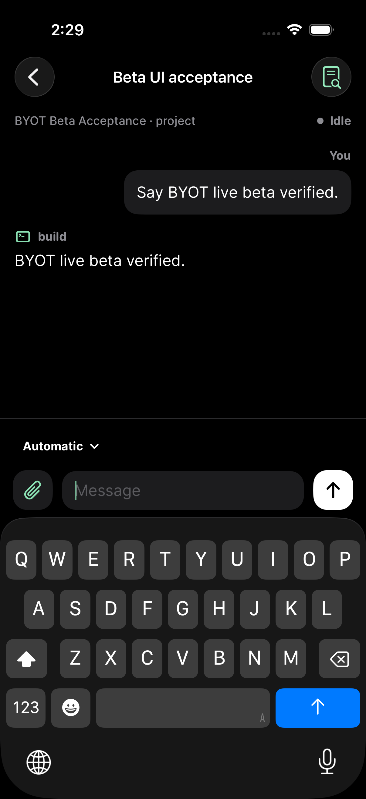
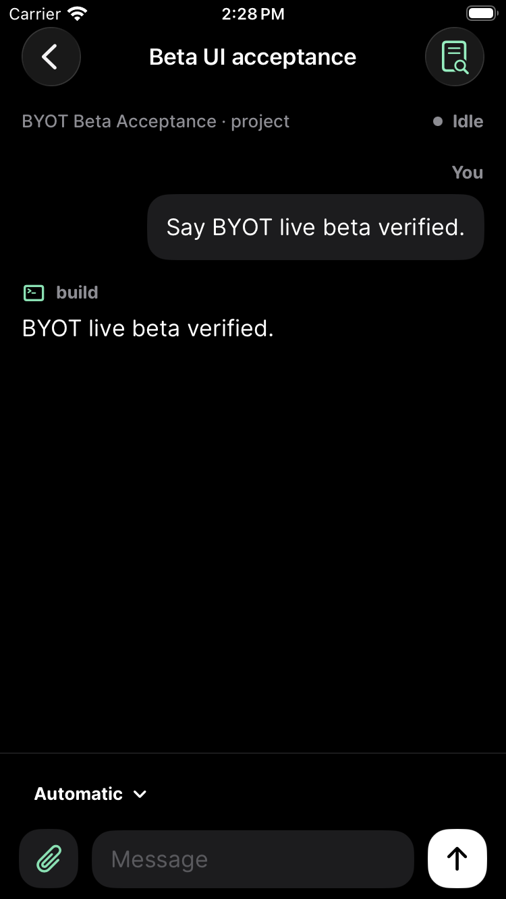

# TestFlight appearance and navigation — 1.0.9

Feedback was retrieved from App Store Connect on September 7, 2026: 48 screenshot submissions and two historical crash-feedback submissions. The newest report, `ADZMRhL_G2pzzGcReIy7Hrs`, is “Colors are all off” on 1.0.8 (20260907135630). Its screenshot shows black transcript text on black, a light composer, and “Idle” wrapping inside a crowded navigation bar. Older feedback also requested BYOT branding and clearer session creation/navigation. This release addresses those current appearance and navigation problems; it does not claim to resolve every historical submission.

## Changes

- Shared canvas/card/control colors now use adaptive iOS surfaces. Primary actions adapt too; mint uses a darker, readable shade in light appearance. The composer matches the transcript instead of mixing a light material with fixed dark fills.
- The home screen is titled BYOT. About has an information button with an explicit accessibility label. Project and session screens use the native Back button without a second hamburger button that only opened About.
- Session status lives below the navigation bar, alongside server/project context. It no longer competes with the title and Changes button or wraps “Idle” into two lines. The context can stack at larger text sizes.
- Successful session creation opens the new chat immediately. A failed request retains the existing error/retry behavior and does not navigate.
- The model control has a dropdown indicator. Compatibility diagnostics remain available under an expandable Server details row, after the projects.

The implementation reuses [Apple’s semantic UI colors](https://developer.apple.com/documentation/uikit/ui-element-colors) and native SwiftUI navigation. OpenCode protocol and persistence code are unchanged.

## Test-first evidence

Test commit: `f011f6b`.

1. Before the fix, the light-appearance regression test failed for all four transcript/composer surfaces: contrast was 1.04–1.40:1 against primary text. The target is at least 4.5:1.
2. Before the navigation fix, the live beta UI test failed at “Creating a session must open its chat immediately.” The session was created but the composer never appeared without another tap in the list.
3. After the fix, the full suite passed: 156 tests passed, zero failures, three opt-in live-server unit tests skipped. The separate live beta UI workflow was enabled and passed, covering connection, creation, send/reply, Changes, native Back navigation, and About.
4. The live workflow also passed in dark appearance on iPhone 17 Pro and on iPhone SE (3rd generation), using iOS 26.5 simulators.

Local result bundles are `/tmp/byot-nav-red-colors.xcresult`, `/tmp/byot-nav-red-navigation-2.xcresult`, `/tmp/byot-nav-green-light.xcresult`, `/tmp/byot-nav-green-dark.xcresult`, and `/tmp/byot-nav-green-compact.xcresult`. The live tests use an isolated OpenCode 2 beta and a local deterministic model response; no paid model calls or tester credentials are involved.

## Screenshots

All images below contain simulator fixture content, not private TestFlight submissions.

| Light appearance | Dark appearance | Compact iPhone |
| --- | --- | --- |
|  |  |  |

The submitted feedback was captured on iOS 27.0. The available simulator runtime is 26.5 and the paired physical iPhone was unavailable, so this release does not claim a physical-device or iOS 27 verification.
