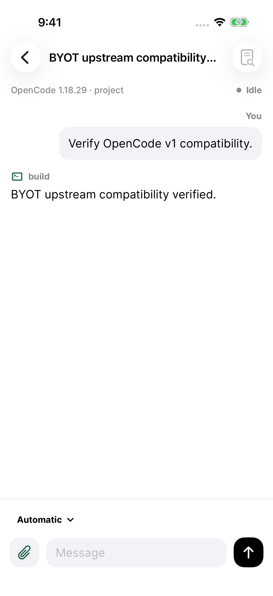
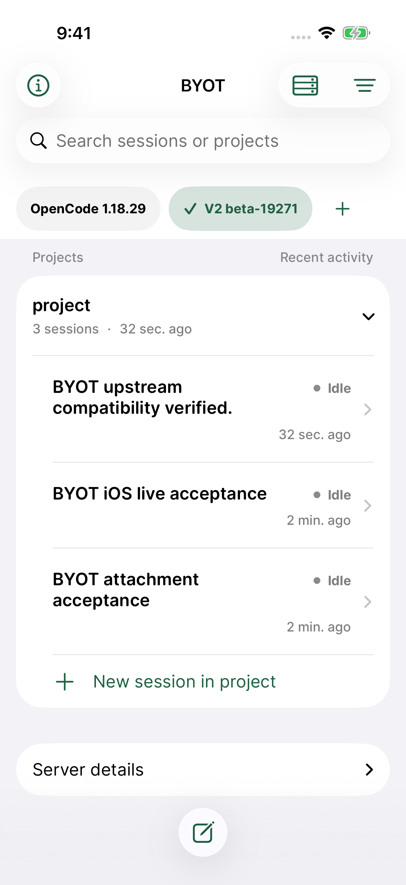

# Service layer validation

App source: `d26520d4eea28219cd59b784fb0c9d586dcd029a`. The full upstream runner passed **176 tests**, with zero failures and zero skips, on iPhone 17 Pro / iOS 26.5 Simulator.

The run used real OpenCode **1.18.29** and **2 beta 19271**, HTTPS, the normal app and Keychain, and a deterministic local model. It covered client operations and UI server setup, sending, transcript reload, model selection, project grouping, saved-server switching, and restoration after relaunch. The eight connection-layer tests cover sharing, refresh races, cancellation, failure recovery, and separate server scopes.

These are original XCTest screenshots from that source revision. Checksums and upstream versions are in [compatibility.json](compatibility.json); counts are in [test-summary.json](test-summary.json). This evidence covers the simulator and pinned server versions.

| OpenCode 1 transcript | OpenCode 2 transcript | Restored server switch |
| --- | --- | --- |
|  |  |  |
